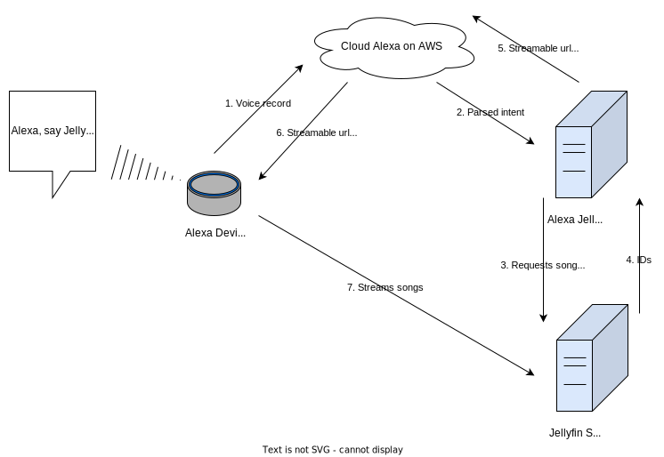

# Jellyfin Alexa Skill

Selfhosted Alexa media player skill for Jellyfin

---

 

  

---

_Note: This project is still in a very early alpha phase, this means not all features are fully functional yet and
features or usage can change significantly between releases. Moreover, new releases can result in data loss of the skill
database._

### Table of Contents

1. [About](#about)
2. [Features](#features)
3. [Installation](#installation)
4. [Supported languages](#supported-languages)
5. [Skill speech examples](#skill-speech-examples)
6. [Project plan](#project-plan)
7. [FAQ](#faq)
8. [Development](#development)
9. [Third party notices](#third-party-notices)
10. [License](#license)

## About

This is a self-hosting Alexa skill to play media from your Jellyfin server. Besides, simple playback, other additional
functions like playback of playlists or managing favorites are included.

The following graph show an overview of the skill interaction flow:

## Features

- playback control:
    - play a specific media
    - play media from an artist
    - pause/resume/stop/cancel a playback
    - play previous/next song in queue
    - repeat a single media
    - repeat all media in queue
    - shuffle mode
    - play internet radio streams
    - navigate through top search results
- playlist:
    - play a specific playlist
- favorite:
    - play favorite media
    - mark current media as favorite
    - remove current media from favorites
- metadata:
    - show the metadata of the media (title and artist)
    - show cover art of the media
- other:
    - multi-language support (see [Supported languages](#supported-languages))
    - multi-user support (any user on the Jellyfin server can use the skill)

If you have a feature idea, use
this [issue template](https://github.com/infinityofspace/jellyfin_alexa_skill/issues/new?labels=feature&template=feature_request.md)
to suggest your idea for implementation.

## Installation

You can find the installation steps in the [wiki](https://github.com/infinityofspace/jellyfin_alexa_skill/wiki/Installation).

## Supported languages

The skill has support for the following languages:

- English
- German
- Italian

## Skill speech examples

The [wiki](https://github.com/infinityofspace/jellyfin_alexa_skill/wiki/Interaction-examples) contains examples how to
interact with the skill.

## Project plan

Take a look at the [project plan](https://github.com/infinityofspace/jellyfin_alexa_skill/projects) to see what features
and bug fixes are planned and in progress.

## FAQ

You can find the FAQ [here](https://github.com/infinityofspace/jellyfin_alexa_skill/wiki/FAQ).

## Development

You can find more guidelines for the
development [here](https://github.com/infinityofspace/jellyfin_alexa_skill/wiki/Development).

## Third party notices

|     Module      |                                              License                                              |                               Project                               |
|:---------------:|:-------------------------------------------------------------------------------------------------:|:-------------------------------------------------------------------:|
|  flask-ask-sdk  | [License](https://raw.githubusercontent.com/alexa/alexa-skills-kit-sdk-for-python/master/LICENSE) | [Project](https://github.com/alexa/alexa-skills-kit-sdk-for-python) |
|  ask-smapi-sdk  | [License](https://raw.githubusercontent.com/alexa/alexa-skills-kit-sdk-for-python/master/LICENSE) | [Project](https://github.com/alexa/alexa-skills-kit-sdk-for-python) |
| ask-smapi-model |      [License](https://raw.githubusercontent.com/alexa/alexa-apis-for-python/master/LICENSE)      |      [Project](https://github.com/alexa/alexa-apis-for-python)      |
|    rapidfuzz    |          [License](https://raw.githubusercontent.com/maxbachmann/RapidFuzz/main/LICENSE)          |         [Project](https://github.com/maxbachmann/RapidFuzz)         |
|     peewee      |            [License](https://raw.githubusercontent.com/coleifer/peewee/master/LICENSE)            |            [Project](https://github.com/coleifer/peewee)            |
|    gunicorn     |           [License](https://raw.githubusercontent.com/benoitc/gunicorn/master/LICENSE)            |           [Project](https://github.com/benoitc/gunicorn)            |
|      Babel      |          [License](https://raw.githubusercontent.com/python-babel/babel/master/LICENSE)           |          [Project](https://github.com/python-babel/babel)           |
|    Flask-WTF    |          [License](https://raw.githubusercontent.com/wtforms/wtforms/master/LICENSE.rst)          |            [Project](https://github.com/wtforms/wtforms)            |
|    requests     |              [License](https://raw.githubusercontent.com/psf/requests/main/LICENSE)               |             [Project](https://github.com/psf/requests)              |
|    psycopg2     |           [License](https://raw.githubusercontent.com/psycopg/psycopg2/master/LICENSE)            |           [Project](https://github.com/psycopg/psycopg2)            |

Furthermore, this readme file contains embeddings of [Shields.io](https://github.com/badges/shields).

## License

[GPL-3.0](https://github.com/infinityofspace/jellyfin_alexa_skill/blob/main/LICENSE)
